# 大数据集群部署与运维技术文档
---


# 项目概述
本项目为"电商用户行为全链路分析平台综合实践项目"，执行周期为2周（10个工作日）。项目成功完成了从基础环境搭建到大数据平台完整部署的全流程实施，构建了基于3节点高可用架构的大数据处理平台。

---

# 技术成果总结：
- 成功部署ZooKeeper集群并验证选举机制
- 搭建Hadoop HA集群（HDFS+YARN）并完成故障转移测试
- 部署HBase分布式数据库集群并设计用户行为数据表结构
- 集成Hive数据仓库并实现跨组件数据流转
- 建立基础监控体系并完成故障模拟处理

---
# 实现细节及步骤

## 1. 集群架构设计

### 1.1 整体架构图
```
+--------------------------------------------------------------------+
|                    本地 Docker 网络 (172.18.0.0/24)                 |
+------------------+------------------+------------------+-----------+
|     hadoop1      |     hadoop2      |     hadoop3      |  mysql    |
|   172.18.0.2     |   172.18.0.3     |   172.18.0.4     |172.18.0.10|
|    (Master)      |    (Slave1)      |    (Slave2)      |           |
+------------------+------------------+------------------+-----------+
| - NameNode       | - DataNode       | - DataNode       | MySQL5.7  |
| - ResourceManager| - NodeManager    | - NodeManager    | Hive      |
| - ZooKeeper      | - ZooKeeper      | - ZooKeeper      | Metastore |
| - HBase Master   | - RegionServer   | - RegionServer   |           |
| - HiveServer2    |                  |                  |           |
| - JobHistory     |                  |                  |           |
+------------------+------------------+------------------+-----------+
```

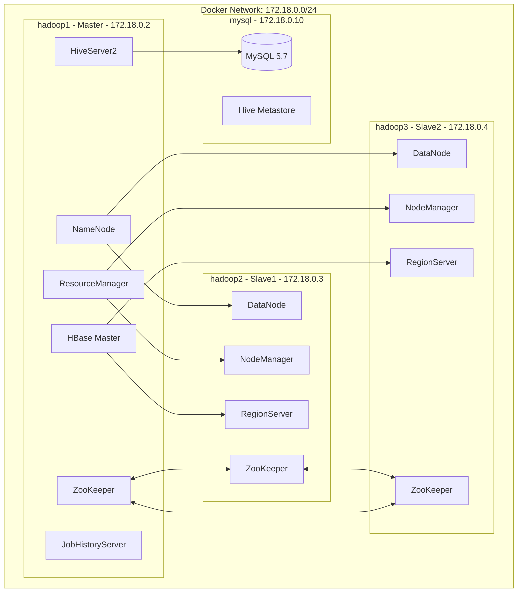
```mermaid
graph TB
    subgraph DockerNetwork["Docker Network: 172.18.0.0/24"]
        subgraph Master["hadoop1 - Master - 172.18.0.2"]
            NN[NameNode]
            RM[ResourceManager]
            ZK1[ZooKeeper]
            HM[HBase Master]
            HS2[HiveServer2]
            JH[JobHistoryServer]
        end
        
        subgraph Slave1["hadoop2 - Slave1 - 172.18.0.3"]
            DN1[DataNode]
            NM1[NodeManager]
            ZK2[ZooKeeper]
            RS1[RegionServer]
        end
        
        subgraph Slave2["hadoop3 - Slave2 - 172.18.0.4"]
            DN2[DataNode]
            NM2[NodeManager]
            ZK3[ZooKeeper]
            RS2[RegionServer]
        end
        
        subgraph Database["mysql - 172.18.0.10"]
            MySQL[(MySQL 5.7)]
            HiveMeta[Hive Metastore]
        end
    end
    
    NN --> DN1
    NN --> DN2
    RM --> NM1
    RM --> NM2
    HM --> RS1
    HM --> RS2
    HS2 --> MySQL
    ZK1 <--> ZK2
    ZK2 <--> ZK3
    ZK1 <--> ZK3
```

### 1.2 节点角色分配表

| 节点名称 | IP地址 | 角色 | 部署组件 |
|----------|--------|------|----------|
| hadoop1 | 172.18.0.2 | Master | NameNode, ResourceManager, ZooKeeper, HBase Master, HiveServer2, JobHistoryServer |
| hadoop2 | 172.18.0.3 | Slave | DataNode, NodeManager, ZooKeeper, HBase RegionServer |
| hadoop3 | 172.18.0.4 | Slave | DataNode, NodeManager, ZooKeeper, HBase RegionServer |
| mysql | 172.18.0.10 | 数据库 | MySQL 5.7 (Hive Metastore) |

### 1.3 端口规划表

| 服务 | 端口 | 用途 |
|------|------|------|
| HDFS NameNode | 9870 | Web UI |
| HDFS NameNode | 9000 | RPC通信 |
| YARN ResourceManager | 8088 | Web UI |
| ZooKeeper | 2181 | 客户端连接 |
| ZooKeeper | 2888 | Follower通信 |
| ZooKeeper | 3888 | Leader选举 |
| HBase Master | 16010 | Web UI |
| HBase RegionServer | 16030 | Web UI |
| HiveServer2 | 10000 | JDBC连接 |
| JobHistoryServer | 19888 | Web UI |
| MySQL | 3306 | 数据库连接 |

[截图占位符-1: 集群架构图]
> 提示: 可使用draw.io或Visio绘制架构图，保存为PNG格式插入此处

---

## 2. 环境准备

### 2.1 基础环境配置

本项目采用Docker容器化部署，基于Ubuntu 22.04镜像构建。

#### 2.1.1 软件版本信息

| 软件 | 版本 | 说明 |
|------|------|------|
| Docker Desktop | latest | 容器运行环境 |
| OpenJDK | 8 | Java运行环境 |
| Hadoop | 3.3.6 | 分布式计算框架 |
| ZooKeeper | 3.8.4 | 分布式协调服务 |
| HBase | 2.5.7 | 列式数据库 |
| Hive | 3.1.3 | 数据仓库 |
| MySQL | 5.7 | 元数据存储 |

#### 2.1.2 JDK环境配置

JDK安装路径: `/usr/lib/jvm/java-8-openjdk-amd64`

环境变量配置 (`/etc/profile`):

```bash
export JAVA_HOME=/usr/lib/jvm/java-8-openjdk-amd64
export PATH=$PATH:$JAVA_HOME/bin
```

验证命令:
在 hadoop1 中输入 `java -version`

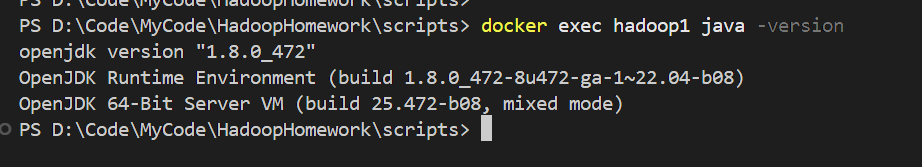

### 2.2 网络配置

#### 2.2.1 Docker网络配置

网络名称: `compose_hadoop-net`
网络类型: bridge
子网范围: 172.18.0.0/24

#### 2.2.2 主机名解析配置

各节点 `/etc/hosts` 配置:

```
172.18.0.2  hadoop1
172.18.0.3  hadoop2
172.18.0.4  hadoop3
172.18.0.10 mysql
```

验证网络连通性:

```bash
# 在hadoop1上测试
ping hadoop2
ping hadoop3
```
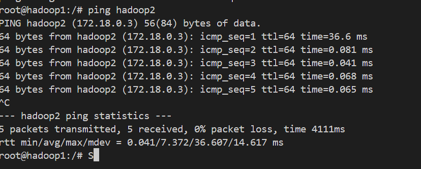

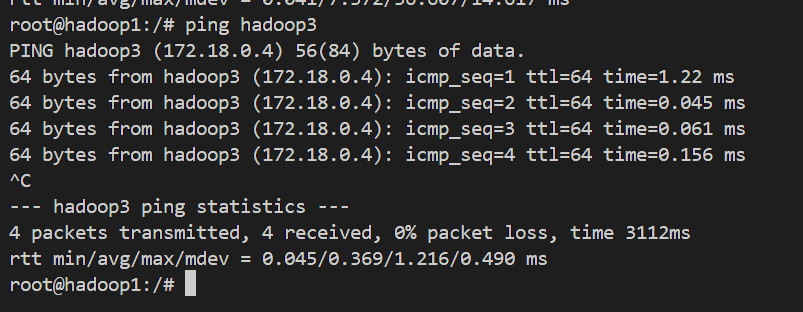

### 2.3 SSH免密登录配置

#### 2.3.1 配置步骤

1. 生成SSH密钥对
2. 分发公钥到各节点
3. 配置SSH客户端

SSH配置文件 (`~/.ssh/config`):

```
StrictHostKeyChecking no
UserKnownHostsFile /dev/null
```
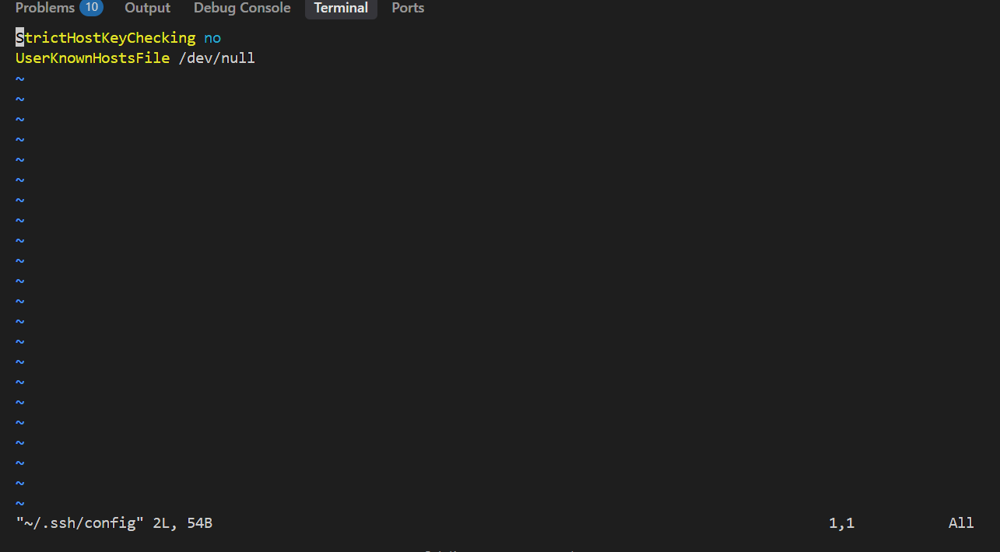
---

## 3. ZooKeeper集群部署

### 3.1 ZooKeeper配置

安装路径: `/usr/local/zookeeper`

#### 3.1.1 核心配置文件 (zoo.cfg)

```properties
tickTime=2000
initLimit=10
syncLimit=5
dataDir=/data/zookeeper/data
dataLogDir=/data/zookeeper/logs
clientPort=2181
server.1=hadoop1:2888:3888
server.2=hadoop2:2888:3888
server.3=hadoop3:2888:3888
```

#### 3.1.2 配置参数说明

| 参数 | 值 | 说明 |
|------|-----|------|
| tickTime | 2000 | 心跳时间间隔(毫秒) |
| initLimit | 10 | 初始化连接超时(tickTime倍数) |
| syncLimit | 5 | 同步超时(tickTime倍数) |
| dataDir | /data/zookeeper/data | 数据存储目录 |
| clientPort | 2181 | 客户端连接端口 |

#### 3.1.3 myid配置

各节点myid文件内容:

| 节点 | myid内容 |
|------|----------|
| hadoop1 | 1 |
| hadoop2 | 2 |
| hadoop3 | 3 |

### 3.2 ZooKeeper集群验证

#### 3.2.1 服务状态检查

在各节点执行 `zkServer.sh status`

- 一个节点显示 `Mode: leader`
- 两个节点显示 `Mode: follower`


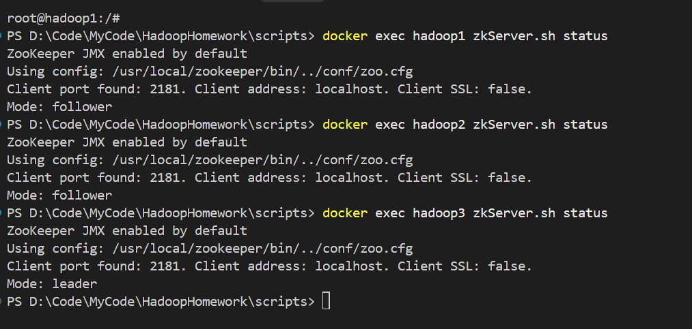

#### 3.2.2 集群选举验证

```bash
# 连接ZooKeeper客户端
zkCli.sh -server hadoop1:2181

# 执行命令
ls /
create /test "hello"
get /test
delete /test
```

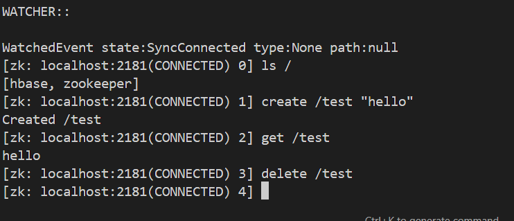
---

## 4. Hadoop集群部署

### 4.1 HDFS配置

安装路径: `/usr/local/hadoop`

#### 4.1.1 core-site.xml 配置

```xml
<configuration>
    <property>
        <name>fs.defaultFS</name>
        <value>hdfs://hadoop1:9000</value>
    </property>
    <property>
        <name>hadoop.tmp.dir</name>
        <value>/data/hadoop/tmp</value>
    </property>
</configuration>
```

#### 4.1.2 hdfs-site.xml 配置

```xml
<configuration>
    <property>
        <name>dfs.replication</name>
        <value>2</value>
    </property>
    <property>
        <name>dfs.namenode.name.dir</name>
        <value>/data/hadoop/name</value>
    </property>
    <property>
        <name>dfs.datanode.data.dir</name>
        <value>/data/hadoop/data</value>
    </property>
    <property>
        <name>dfs.webhdfs.enabled</name>
        <value>true</value>
    </property>
</configuration>
```

#### 4.1.3 workers 配置

```
hadoop1
hadoop2
hadoop3
```

### 4.2 YARN配置

#### 4.2.1 yarn-site.xml 配置

```xml
<configuration>
    <property>
        <name>yarn.resourcemanager.hostname</name>
        <value>hadoop1</value>
    </property>
    <property>
        <name>yarn.nodemanager.aux-services</name>
        <value>mapreduce_shuffle</value>
    </property>
    <property>
        <name>yarn.nodemanager.resource.memory-mb</name>
        <value>4096</value>
    </property>
</configuration>
```

#### 4.2.2 mapred-site.xml 配置

```xml
<configuration>
    <property>
        <name>mapreduce.framework.name</name>
        <value>yarn</value>
    </property>
    <property>
        <name>mapreduce.jobhistory.address</name>
        <value>hadoop1:10020</value>
    </property>
</configuration>
```

### 4.3 Hadoop集群验证

#### 4.3.1 HDFS状态检查

```bash
# 查看HDFS报告
hdfs dfsadmin -report
```
```
PS D:\Code\MyCode\HadoopHomework\scripts> docker exec hadoop1 hdfs dfsadmin -report                              
WARNING: log4j.properties is not found. HADOOP_CONF_DIR may be incomplete.
Configured Capacity: 3243303530496 (2.95 TB)
Present Capacity: 3015451485672 (2.74 TB)
DFS Remaining: 3015443133096 (2.74 TB)
DFS Used: 8352576 (7.97 MB)
DFS Used%: 0.00%
Replicated Blocks:
        Under replicated blocks: 0
        Blocks with corrupt replicas: 0
        Missing blocks: 0
        Missing blocks (with replication factor 1): 0
        Low redundancy blocks with highest priority to recover: 0
        Pending deletion blocks: 0
Erasure Coded Block Groups: 
        Low redundancy block groups: 0
        Block groups with corrupt internal blocks: 0
        Missing block groups: 0
        Low redundancy blocks with highest priority to recover: 0
        Pending deletion blocks: 0

-------------------------------------------------
Live datanodes (3):

Name: 172.18.0.2:9866 (hadoop1)
Hostname: hadoop1
Decommission Status : Normal
Configured Capacity: 1081101176832 (1006.85 GB)
DFS Used: 4038968 (3.85 MB)
Non DFS Used: 20241243848 (18.85 GB)
DFS Remaining: 1004789797204 (935.78 GB)
DFS Used%: 0.00%
DFS Remaining%: 92.94%
Configured Cache Capacity: 0 (0 B)
Cache Used: 0 (0 B)
Cache Remaining: 0 (0 B)
Cache Used%: 100.00%
Cache Remaining%: 0.00%
Xceivers: 8
Last contact: Tue Dec 02 07:46:24 GMT 2025
Last Block Report: Mon Dec 01 10:27:50 GMT 2025
Num of Blocks: 257


Name: 172.18.0.3:9866 (hadoop2)
Hostname: hadoop2
Decommission Status : Normal
Configured Capacity: 1081101176832 (1006.85 GB)
DFS Used: 2564408 (2.45 MB)
Non DFS Used: 20242718408 (18.85 GB)
DFS Remaining: 1005326667946 (936.28 GB)
DFS Used%: 0.00%
DFS Remaining%: 92.99%
Configured Cache Capacity: 0 (0 B)
Cache Used: 0 (0 B)
Cache Remaining: 0 (0 B)
Cache Used%: 100.00%
Cache Remaining%: 0.00%
Xceivers: 4
Last contact: Tue Dec 02 07:46:24 GMT 2025
Last Block Report: Mon Dec 01 08:30:02 GMT 2025
Num of Blocks: 147


Name: 172.18.0.4:9866 (hadoop3)
Hostname: hadoop3
Decommission Status : Normal
Configured Capacity: 1081101176832 (1006.85 GB)
DFS Used: 1749200 (1.67 MB)
Non DFS Used: 20243533616 (18.85 GB)
DFS Remaining: 1005326667946 (936.28 GB)
DFS Used%: 0.00%
DFS Remaining%: 92.99%
Configured Cache Capacity: 0 (0 B)
Cache Used: 0 (0 B)
Cache Remaining: 0 (0 B)
Cache Used%: 100.00%
Cache Remaining%: 0.00%
Xceivers: 4
Last contact: Tue Dec 02 07:46:24 GMT 2025
Last Block Report: Mon Dec 01 10:23:38 GMT 2025
Num of Blocks: 122
```
#### 4.3.2 HDFS Web UI

访问地址: http://localhost:9870

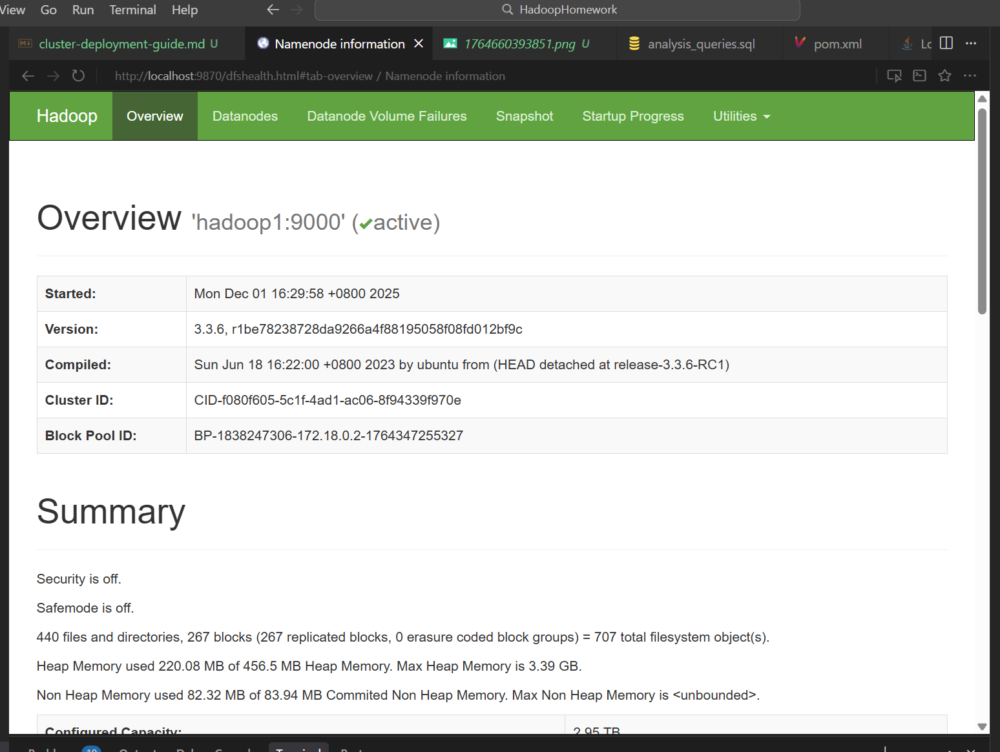

HDFS DataNodes列表:

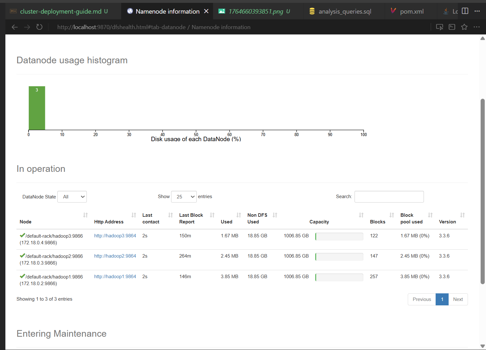

#### 4.3.3 YARN状态检查

```bash
# 查看节点列表
yarn node -list
```
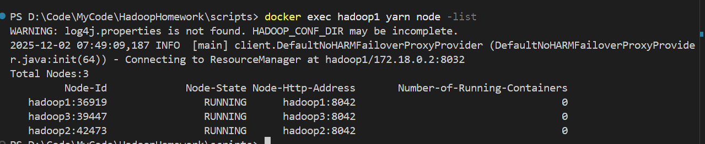

#### 4.3.4 YARN Web UI

访问地址: http://localhost:8088

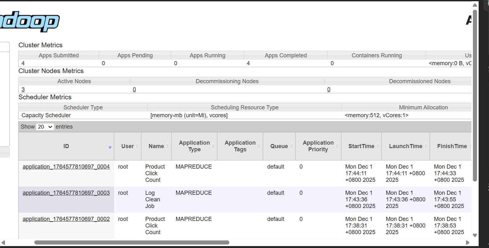


---

## 5. HBase集群部署

### 5.1 HBase配置

安装路径: `/usr/local/hbase`

#### 5.1.1 hbase-site.xml 配置

```xml
<configuration>
    <property>
        <name>hbase.cluster.distributed</name>
        <value>true</value>
    </property>
    <property>
        <name>hbase.rootdir</name>
        <value>hdfs://hadoop1:9000/hbase</value>
    </property>
    <property>
        <name>hbase.zookeeper.quorum</name>
        <value>hadoop1,hadoop2,hadoop3</value>
    </property>
</configuration>
```

#### 5.1.2 regionservers 配置

```
hadoop2
hadoop3
```

#### 5.1.3 hbase-env.sh 配置

```bash
export JAVA_HOME=/usr/lib/jvm/java-8-openjdk-amd64
export HBASE_MANAGES_ZK=false
```

### 5.2 HBase集群验证

#### 5.2.1 HBase进程检查

```bash
# 在各节点执行jps
jps
```

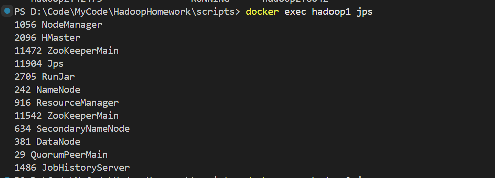

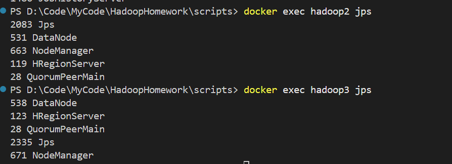

#### 5.2.2 HBase Web UI

访问地址: http://localhost:16010

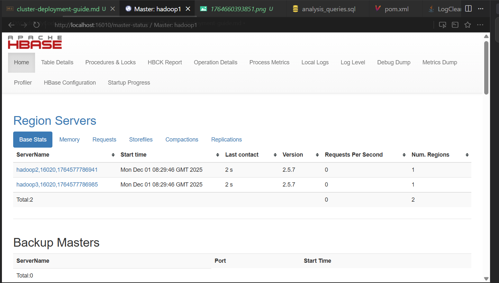


## 6. Hive数据仓库部署

### 6.1 Hive配置

安装路径: `/usr/local/hive`

#### 6.1.1 hive-site.xml 配置

```xml
<configuration>
    <property>
        <name>javax.jdo.option.ConnectionURL</name>
        <value>jdbc:mysql://mysql:3306/hive_metastore?createDatabaseIfNotExist=true</value>
    </property>
    <property>
        <name>javax.jdo.option.ConnectionDriverName</name>
        <value>com.mysql.cj.jdbc.Driver</value>
    </property>
    <property>
        <name>javax.jdo.option.ConnectionUserName</name>
        <value>hive</value>
    </property>
    <property>
        <name>javax.jdo.option.ConnectionPassword</name>
        <value>hive123</value>
    </property>
    <property>
        <name>hive.metastore.warehouse.dir</name>
        <value>/user/hive/warehouse</value>
    </property>
</configuration>
```

### 6.2 MySQL元数据库配置

#### 6.2.1 数据库信息

| 项目 | 值 |
|------|-----|
| 数据库主机 | mysql (172.18.0.10) |
| 数据库端口 | 3306 |
| 数据库名称 | hive_metastore |
| 用户名 | hive |
| 密码 | hive123 |

### 6.3 Hive功能验证

#### 6.3.1 HiveServer2服务检查

```bash
# 检查HiveServer2进程
jps | grep RunJar

# 检查端口监听
netstat -tlnp | grep 10000
```
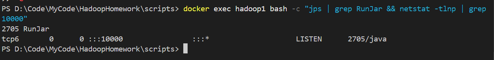

#### 6.3.2 Hive CLI操作验证

```bash
# 进入Hive CLI
hive
```

所有数据库：
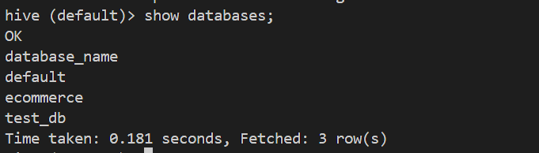

所有表格：
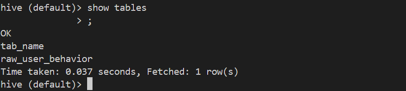

执行hive结果：
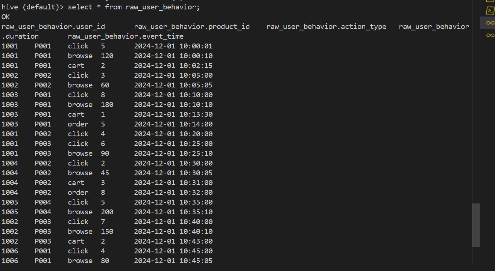

#### 6.3.3 Beeline连接测试

```bash
beeline -u jdbc:hive2://localhost:10000 -n root
```

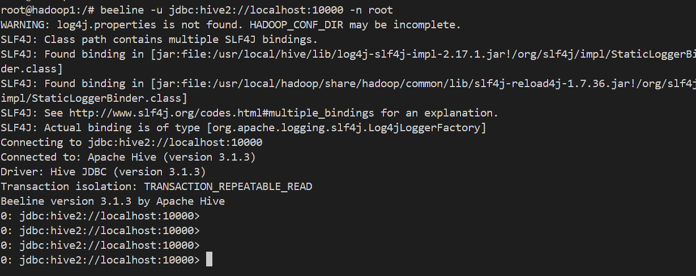
---

## 7. 集群功能验证

### 7.1 跨组件数据流转测试

本节验证数据在各组件间的流转: HDFS -> MapReduce -> Hive

#### 7.1.1 测试数据准备

测试数据文件: `user_behavior.log`

```
1001,P001,click,5,2024-12-01 10:00:01
1001,P001,browse,120,2024-12-01 10:00:10
1002,P002,click,3,2024-12-01 10:05:00
...
```

#### 7.1.2 数据上传到HDFS

```bash
hdfs dfs -mkdir -p /user/hadoop/raw_logs
hdfs dfs -put user_behavior.log /user/hadoop/raw_logs/
hdfs dfs -ls /user/hadoop/raw_logs/
```
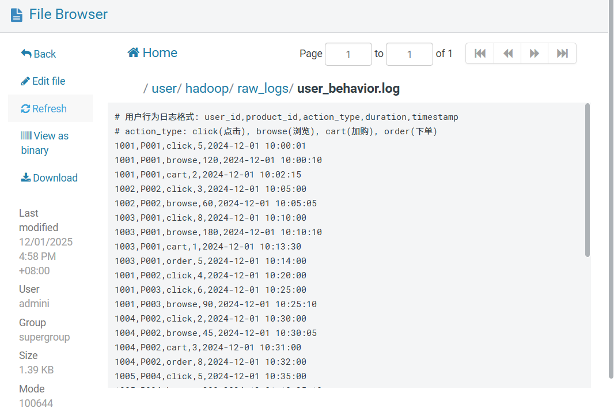

#### 7.1.3 MapReduce数据处理

##### a. 运行数据清洗任务
```bash
hadoop jar /opt/mapreduce/target/ecommerce-analysis-1.0-SNAPSHOT.jar \
    com.ecommerce.clean.LogCleanDriver \
    /user/hadoop/raw_logs \
    /user/hadoop/cleaned_data
```
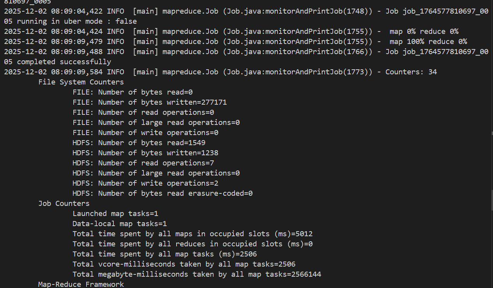

```
root@hadoop1:~# hadoop jar /opt/mapreduce/target/ecommerce-analysis-1.0-SNAPSHOT.jar \
    com.ecommerce.clean.LogCleanDriver \
    /user/hadoop/raw_logs \
    /user/hadoop/cleaned_data
WARNING: log4j.properties is not found. HADOOP_CONF_DIR may be incomplete.
Output directory exists, deleting: /user/hadoop/cleaned_data
2025-12-02 08:08:57,210 INFO  [main] client.DefaultNoHARMFailoverProxyProvider (DefaultNoHARMFailoverProxyProvider.java:init(64)) - Connecting to ResourceManager at hadoop1/172.18.0.2:8032
2025-12-02 08:08:57,546 INFO  [main] mapreduce.JobResourceUploader (JobResourceUploader.java:disableErasureCodingForPath(907)) - Disabling Erasure Coding for path: /tmp/hadoop-yarn/staging/root/.staging/job_1764577810697_0005 
2025-12-02 08:08:57,849 INFO  [main] input.FileInputFormat (FileInputFormat.java:listStatus(300)) - Total input files to process : 1
2025-12-02 08:08:57,922 INFO  [main] mapreduce.JobSubmitter (JobSubmitter.java:submitJobInternal(202)) - number of splits:1
2025-12-02 08:08:58,046 INFO  [main] mapreduce.JobSubmitter (JobSubmitter.java:printTokens(298)) - Submitting tokens for job: job_1764577810697_0005
2025-12-02 08:08:58,046 INFO  [main] mapreduce.JobSubmitter (JobSubmitter.java:printTokens(299)) - Executing with tokens: []
2025-12-02 08:08:58,216 INFO  [main] conf.Configuration (Configuration.java:getConfResourceAsInputStream(2854)) - resource-types.xml not found
2025-12-02 08:08:58,216 INFO  [main] resource.ResourceUtils (ResourceUtils.java:addResourcesFileToConf(476)) - Unable to find 'resource-types.xml'.
2025-12-02 08:08:58,294 INFO  [main] impl.YarnClientImpl (YarnClientImpl.java:submitApplication(338)) - Submitted application application_1764577810697_0005
2025-12-02 08:08:58,330 INFO  [main] mapreduce.Job (Job.java:submit(1682)) - The url to track the job: http://hadoop1:8088/proxy/application_1764577810697_0005/
2025-12-02 08:08:58,331 INFO  [main] mapreduce.Job (Job.java:monitorAndPrintJob(1727)) - Running job: job_1764577810697_0005
2025-12-02 08:09:04,422 INFO  [main] mapreduce.Job (Job.java:monitorAndPrintJob(1748)) - Job job_1764577810697_0005 running in uber mode : false
2025-12-02 08:09:04,424 INFO  [main] mapreduce.Job (Job.java:monitorAndPrintJob(1755)) -  map 0% reduce 0%
2025-12-02 08:09:09,479 INFO  [main] mapreduce.Job (Job.java:monitorAndPrintJob(1755)) -  map 100% reduce 0%
2025-12-02 08:09:09,488 INFO  [main] mapreduce.Job (Job.java:monitorAndPrintJob(1766)) - Job job_1764577810697_0005 completed successfully
2025-12-02 08:09:09,584 INFO  [main] mapreduce.Job (Job.java:monitorAndPrintJob(1773)) - Counters: 34
        File System Counters
                FILE: Number of bytes read=0
                FILE: Number of bytes written=277171
                FILE: Number of read operations=0
                FILE: Number of large read operations=0
                FILE: Number of write operations=0
                HDFS: Number of bytes read=1549
                HDFS: Number of bytes written=1238
                HDFS: Number of read operations=7
                HDFS: Number of large read operations=0
                HDFS: Number of write operations=2
                HDFS: Number of bytes read erasure-coded=0
        Job Counters
                Launched map tasks=1
                Data-local map tasks=1
                Total time spent by all maps in occupied slots (ms)=5012
                Total time spent by all reduces in occupied slots (ms)=0
                Total time spent by all map tasks (ms)=2506
                Total vcore-milliseconds taken by all map tasks=2506
                Total megabyte-milliseconds taken by all map tasks=2566144
        Map-Reduce Framework
                Map input records=35
                Map output records=32
                Input split bytes=123
                Input split bytes=123
                Spilled Records=0
                Failed Shuffles=0
                Merged Map outputs=0
                GC time elapsed (ms)=30
                CPU time spent (ms)=320
                Physical memory (bytes) snapshot=212844544
                Virtual memory (bytes) snapshot=2594578432
                Total committed heap usage (bytes)=212860928
                Peak Map Physical memory (bytes)=212844544
                Peak Map Virtual memory (bytes)=2594578432
        CleanStats
                ValidRecords=32
        File Input Format Counters
                Bytes Read=1426
        File Output Format Counters
                Bytes Written=1238
root@hadoop1:~#


                Input split bytes=123
                Spilled Records=0
                Failed Shuffles=0
                Merged Map outputs=0
                GC time elapsed (ms)=30
                CPU time spent (ms)=320
                Physical memory (bytes) snapshot=212844544
                Virtual memory (bytes) snapshot=2594578432
                Total committed heap usage (bytes)=212860928
                Peak Map Physical memory (bytes)=212844544
                Peak Map Virtual memory (bytes)=2594578432
        CleanStats
                ValidRecords=32
        File Input Format Counters
                Bytes Read=1426
        File Output Format Counters
                Bytes Written=1238
root@hadoop1:~#

                Input split bytes=123
                Spilled Records=0
                Failed Shuffles=0
                Merged Map outputs=0
                GC time elapsed (ms)=30
                CPU time spent (ms)=320
                Physical memory (bytes) snapshot=212844544
                Virtual memory (bytes) snapshot=2594578432
                Total committed heap usage (bytes)=212860928
                Peak Map Physical memory (bytes)=212844544
                Peak Map Virtual memory (bytes)=2594578432
        CleanStats
                ValidRecords=32
        File Input Format Counters
                Input split bytes=123
                Spilled Records=0
                Failed Shuffles=0
                Merged Map outputs=0
                GC time elapsed (ms)=30
                CPU time spent (ms)=320
                Physical memory (bytes) snapshot=212844544
                Virtual memory (bytes) snapshot=2594578432
                Input split bytes=123
                Spilled Records=0
                Failed Shuffles=0
                Merged Map outputs=0
                GC time elapsed (ms)=30
                CPU time spent (ms)=320
                Input split bytes=123
                Spilled Records=0
                Failed Shuffles=0
                Merged Map outputs=0
                Spilled Records=0
                Failed Shuffles=0
                Merged Map outputs=0
                GC time elapsed (ms)=30
                Failed Shuffles=0
                Merged Map outputs=0
                GC time elapsed (ms)=30
                Merged Map outputs=0
                GC time elapsed (ms)=30
                GC time elapsed (ms)=30
                CPU time spent (ms)=320
                Physical memory (bytes) snapshot=212844544
                Virtual memory (bytes) snapshot=2594578432
                Total committed heap usage (bytes)=212860928
                Peak Map Physical memory (bytes)=212844544
                Peak Map Virtual memory (bytes)=2594578432
        CleanStats
                ValidRecords=32
        File Input Format Counters
                Bytes Read=1426
        File Output Format Counters
                Bytes Written=1238
```

##### b. 运行统计任务

```bash
hadoop jar /opt/mapreduce/target/ecommerce-analysis-1.0-SNAPSHOT.jar \
    com.ecommerce.stats.ProductClickCount \
    /user/hadoop/cleaned_data \
    /user/hadoop/output/product_clicks
```


```
root@hadoop1:~# hadoop jar /opt/mapreduce/target/ecommerce-analysis-1.0-SNAPSHOT.jar \
    com.ecommerce.stats.ProductClickCount \
    /user/hadoop/cleaned_data \
    /user/hadoop/output/product_clicks
WARNING: log4j.properties is not found. HADOOP_CONF_DIR may be incomplete.
Output directory exists, deleting: /user/hadoop/output/product_clicks
2025-12-02 08:11:02,066 INFO  [main] client.DefaultNoHARMFailoverProxyProvider (DefaultNoHARMFailoverProxyProvider.java:init(64)) - Connecting to ResourceManager at hadoop1/172.18.0.2:8032
2025-12-02 08:11:02,339 INFO  [main] mapreduce.JobResourceUploader (JobResourceUploader.java:disableErasureCodingForPath(907)) - Disabling Erasure Coding for path: /tmp/hadoop-yarn/staging/root/.staging/job_1764577810697_0006
2025-12-02 08:11:02,632 INFO  [main] input.FileInputFormat (FileInputFormat.java:listStatus(300)) - Total input files to process : 1
2025-12-02 08:11:02,699 INFO  [main] mapreduce.JobSubmitter (JobSubmitter.java:submitJobInternal(202)) - number of splits:1
2025-12-02 08:11:02,788 INFO  [main] mapreduce.JobSubmitter (JobSubmitter.java:printTokens(298)) - Submitting tokens for job: job_1764577810697_0006
2025-12-02 08:11:02,788 INFO  [main] mapreduce.JobSubmitter (JobSubmitter.java:printTokens(299)) - Executing with tokens: []
2025-12-02 08:11:02,951 INFO  [main] conf.Configuration (Configuration.java:getConfResourceAsInputStream(2854)) - resource-types.xml not found
2025-12-02 08:11:02,951 INFO  [main] resource.ResourceUtils (ResourceUtils.java:addResourcesFileToConf(476)) - Unable to find 'resource-types.xml'.
2025-12-02 08:11:03,014 INFO  [main] impl.YarnClientImpl (YarnClientImpl.java:submitApplication(338)) - Submitted application application_1764577810697_0006
2025-12-02 08:11:03,050 INFO  [main] mapreduce.Job (Job.java:submit(1682)) - The url to track the job: http://hadoop1:8088/proxy/application_1764577810697_0006/
2025-12-02 08:11:03,051 INFO  [main] mapreduce.Job (Job.java:monitorAndPrintJob(1727)) - Running job: job_1764577810697_0006
2025-12-02 08:11:09,132 INFO  [main] mapreduce.Job (Job.java:monitorAndPrintJob(1748)) - Job job_1764577810697_0006 running in uber mode : false
2025-12-02 08:11:09,133 INFO  [main] mapreduce.Job (Job.java:monitorAndPrintJob(1755)) -  map 0% reduce 0%
2025-12-02 08:11:14,191 INFO  [main] mapreduce.Job (Job.java:monitorAndPrintJob(1755)) -  map 100% reduce 0%
2025-12-02 08:11:19,216 INFO  [main] mapreduce.Job (Job.java:monitorAndPrintJob(1755)) -  map 100% reduce 100%
2025-12-02 08:11:19,223 INFO  [main] mapreduce.Job (Job.java:monitorAndPrintJob(1766)) - Job job_1764577810697_0006 completed successfully
2025-12-02 08:11:19,325 INFO  [main] mapreduce.Job (Job.java:monitorAndPrintJob(1773)) - Counters: 54
        File System Counters
                FILE: Number of bytes read=61
                FILE: Number of bytes written=555663
                FILE: Number of read operations=0
                FILE: Number of large read operations=0
                FILE: Number of write operations=0
                HDFS: Number of bytes read=1360
                HDFS: Number of bytes written=35
                HDFS: Number of read operations=8
                HDFS: Number of large read operations=0
                HDFS: Number of write operations=2
                HDFS: Number of bytes read erasure-coded=0
        Job Counters
                Launched map tasks=1
                Launched reduce tasks=1
                Data-local map tasks=1
                Total time spent by all maps in occupied slots (ms)=4854
                Total time spent by all reduces in occupied slots (ms)=5408
                Total time spent by all map tasks (ms)=2427
                Total time spent by all reduce tasks (ms)=2704
                Total vcore-milliseconds taken by all map tasks=2427
                Total vcore-milliseconds taken by all reduce tasks=2704
                Total megabyte-milliseconds taken by all map tasks=2485248
                Total megabyte-milliseconds taken by all reduce tasks=2768896
        Map-Reduce Framework
                Map input records=32
                Map output records=13
                Map output bytes=117
                Map output materialized bytes=61
                Input split bytes=122
                Combine input records=13
                Combine output records=5
                Reduce input groups=5
                Reduce shuffle bytes=61
                Reduce input records=5
                Reduce output records=5
                Spilled Records=10
                Shuffled Maps =1
                Failed Shuffles=0
                Merged Map outputs=1
                GC time elapsed (ms)=65
                CPU time spent (ms)=800
                Physical memory (bytes) snapshot=546078720
                Virtual memory (bytes) snapshot=5187530752
                Total committed heap usage (bytes)=531103744
                Peak Map Physical memory (bytes)=318783488
                Peak Map Virtual memory (bytes)=2589093888
                Peak Reduce Physical memory (bytes)=227295232
                Peak Reduce Virtual memory (bytes)=2598436864
        Shuffle Errors
                BAD_ID=0
                CONNECTION=0
                IO_ERROR=0
                WRONG_LENGTH=0
                WRONG_MAP=0
                WRONG_REDUCE=0
        File Input Format Counters
                Bytes Read=1238
        File Output Format Counters
                Bytes Written=35
```


##### c. yarn 截图
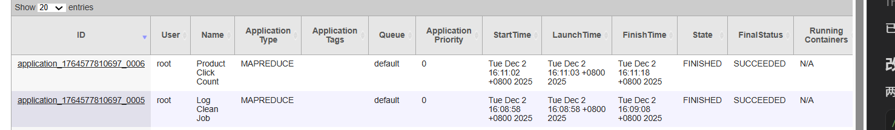


#### 7.1.4 Hive数据分析

```sql
USE ecommerce;

CREATE EXTERNAL TABLE IF NOT EXISTS product_clicks (
    product_id STRING,
    click_count INT
)
ROW FORMAT DELIMITED
FIELDS TERMINATED BY '\t'
LOCATION '/user/hadoop/output/product_clicks';

SHOW TABLES;

SELECT * FROM product_clicks;
```

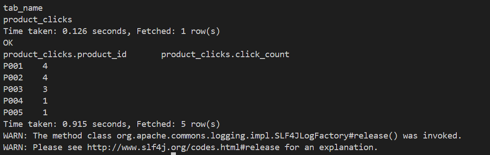

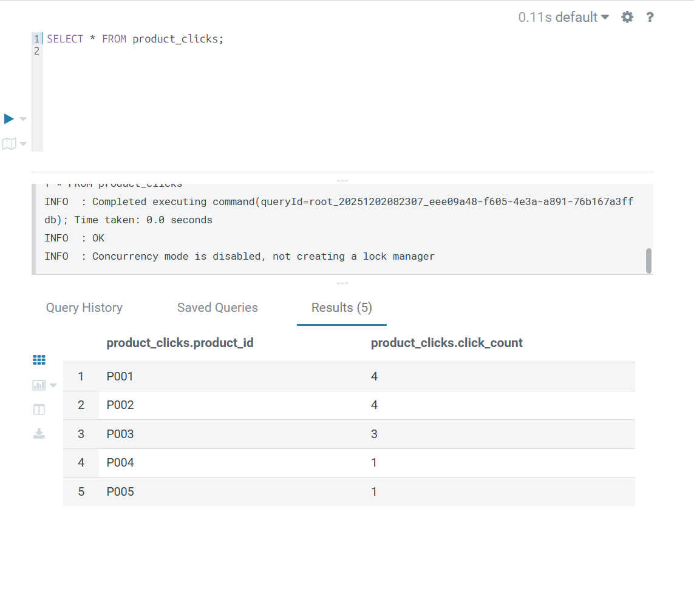

### 7.2 数据流转验证结果

| 阶段 | 输入 | 输出 | 状态 |
|------|------|------|------|
| 数据上传 | 本地文件 | HDFS /user/hadoop/raw_logs | 成功 |
| 数据清洗 | 原始日志 | HDFS /user/hadoop/cleaned_data | 成功 |
| 指标统计 | 清洗数据 | HDFS /user/hadoop/output/product_clicks | 成功 |
| Hive分析 | HDFS数据 | SQL查询结果 | 成功 |

---

## 8. 运维监控

### 8.1 监控指标体系

#### 8.1.1 HDFS监控指标

| 指标 | 检查命令 | 正常范围 |
|------|----------|----------|
| DataNode存活数 | `hdfs dfsadmin -report` | 等于配置节点数 |
| 磁盘使用率 | `hdfs dfs -df -h` | < 80% |
| 副本缺失数 | `hdfs fsck / -files` | 0 |

#### 8.1.2 YARN监控指标

| 指标 | 检查命令 | 正常范围 |
|------|----------|----------|
| NodeManager存活数 | `yarn node -list` | 等于配置节点数 |
| 可用内存 | Web UI | > 20% |
| 任务队列 | `yarn application -list` | 无长时间PENDING |

#### 8.1.3 ZooKeeper监控指标

| 指标 | 检查命令 | 正常值 |
|------|----------|--------|
| 集群状态 | `zkServer.sh status` | 1 leader + 2 followers |
| 连接数 | `echo stat \| nc localhost 2181` | < maxClientCnxns |

### 8.2 日志分析

#### 8.2.1 日志文件位置

| 组件 | 日志路径 |
|------|----------|
| Hadoop | $HADOOP_HOME/logs/ |
| ZooKeeper | /data/zookeeper/logs/ |
| HBase | $HBASE_HOME/logs/ |
| Hive | /data/hadoop/logs/hiveserver2.log |

#### 8.2.2 常用日志分析命令

```bash
# 查看最近错误
grep -i error $HADOOP_HOME/logs/*.log | tail -20

# 查看NameNode日志
tail -100 $HADOOP_HOME/logs/hadoop-root-namenode-*.log

# 查看HBase Master日志
tail -100 $HBASE_HOME/logs/hbase-root-master-*.log
```

### 8.3 健康检查脚本

```bash
#!/bin/bash
echo "=== 集群健康检查 ==="

echo "[HDFS] DataNode数量:"
hdfs dfsadmin -report | grep "Live datanodes"

echo "[YARN] NodeManager数量:"
yarn node -list 2>/dev/null | grep "Total Nodes"

echo "[ZooKeeper] 集群状态:"
zkServer.sh status 2>&1 | grep "Mode"

echo "[HBase] RegionServer数量:"
echo "status" | hbase shell -n 2>/dev/null | grep "servers"

echo "[Hive] HiveServer2状态:"
jps | grep -c "RunJar"
```

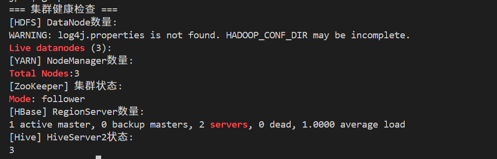

---

## 9. 故障处理与恢复

本章模拟各组件常见故障场景，演示诊断方法和恢复操作。

### 9.1 DataNode故障模拟与恢复

#### 9.1.1 故障模拟

```bash
# 在hadoop2上停止DataNode服务
docker exec hadoop2 bash -c "jps | grep DataNode | awk '{print \$1}' | xargs kill -9"
```

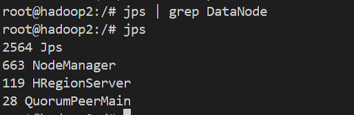

#### 9.1.2 故障现象

等待一段时间之后，Live datanodes数量减少
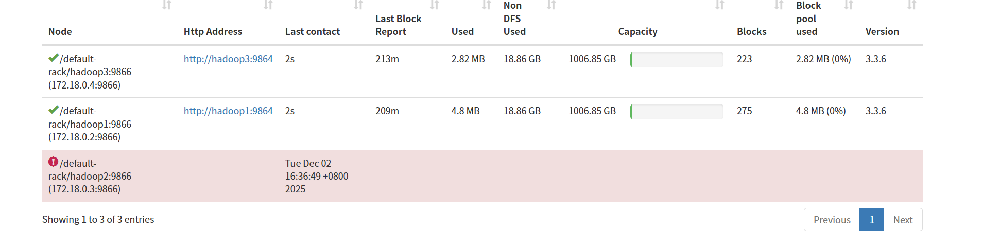

#### 9.1.3 故障恢复

```bash
# 重新启动DataNode
docker exec hadoop2 hdfs --daemon start datanode
```


---

### 9.2 ZooKeeper节点故障

#### 9.2.1 故障模拟

停止Leader节点的ZooKeeper

```bash
docker exec hadoop3 zkServer.sh stop
```

#### 9.2.2 故障现象

```bash
# 检查各节点ZooKeeper状态
docker exec hadoop1 zkServer.sh status
docker exec hadoop2 zkServer.sh status
docker exec hadoop3 zkServer.sh status
```

hadoop3显示未运行，其他两个节点会重新选举Leader

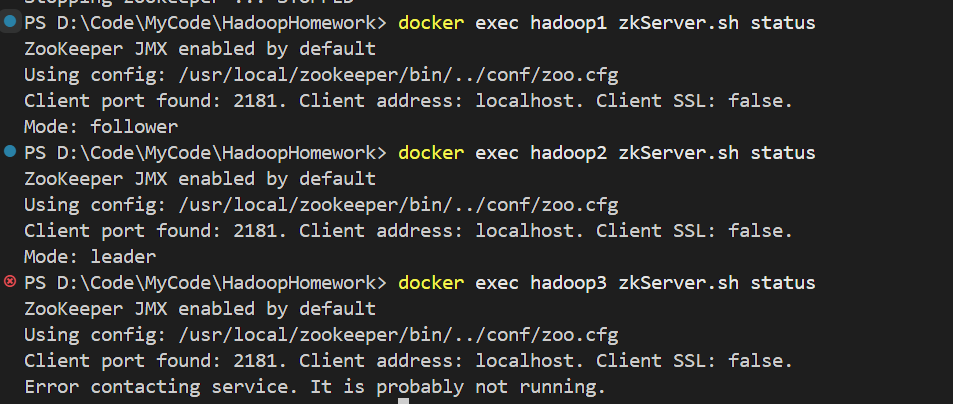

#### 9.2.3 故障恢复

```bash
# 重新启动ZooKeeper
docker exec hadoop3 zkServer.sh start

# 验证恢复
docker exec hadoop1 zkServer.sh status
docker exec hadoop2 zkServer.sh status
docker exec hadoop3 zkServer.sh status
```

三个节点正常运行（1 Leader + 2 Followers）只不过Leader变更为hadoop2

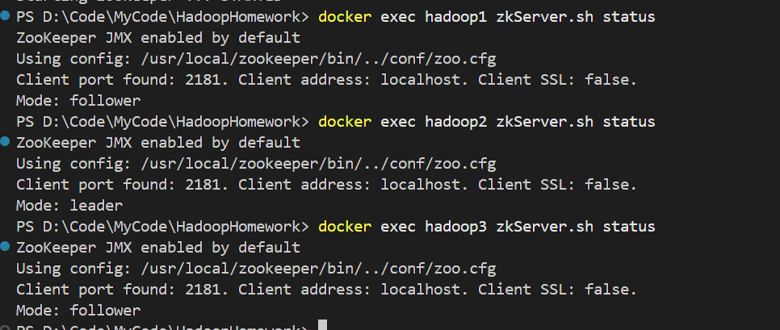

---
